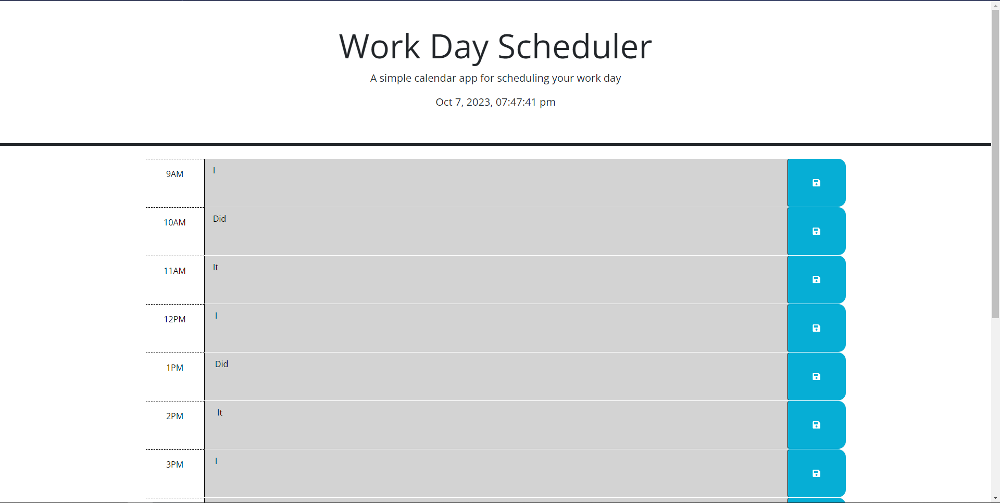

# Ticking-Schedule

Schedule that slowly edits availability by changing background colors, and saves data for later.

## Description

I added the js for a website designed to save input, and change background based on the time. With this I was able to traverse the dom better as well as understand the abilities of varibles being filters for adapting data.

## Installation

Installation: https://github.com/B-R-Ls/Ticking-Schedule

Deployed Paged: https://b-r-ls.github.io/Ticking-Schedule/

## Usage

This page presents the time as well as mark out availability hours throughout the day. You can save notes for later with one click of the save button.

## Credits

Day JS: https://day.js.org/
jQuery: https://jquery.com/
BootStrap: https://getbootstrap.com/
FontAwsome: https://fontawesome.com/
Google Fonts: https://fonts.google.com/

## License

MIT License